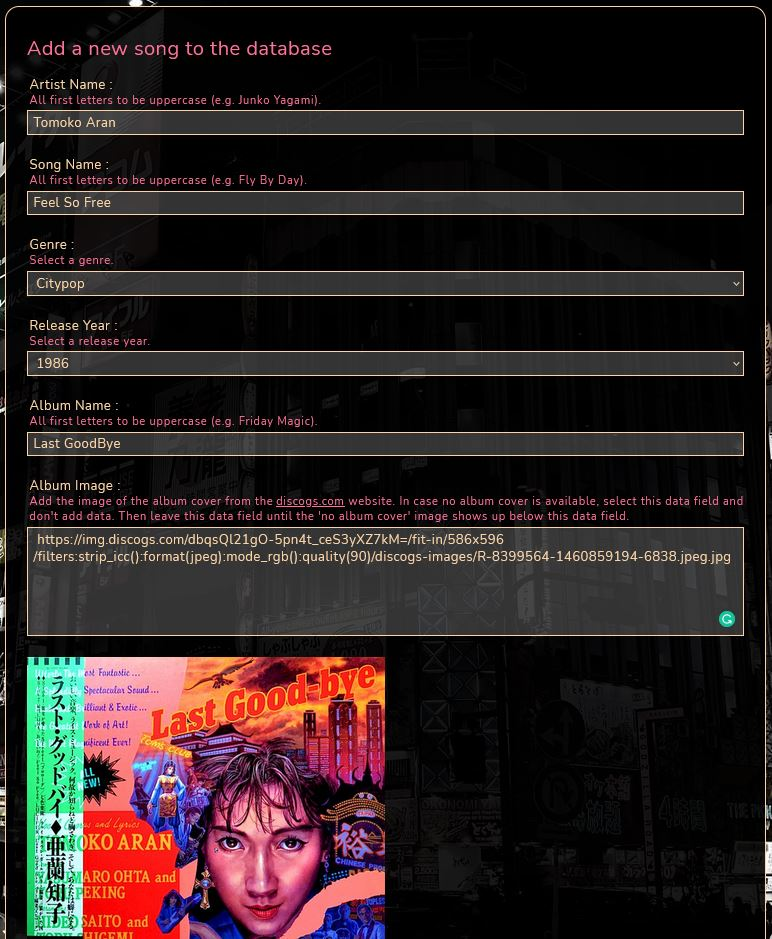
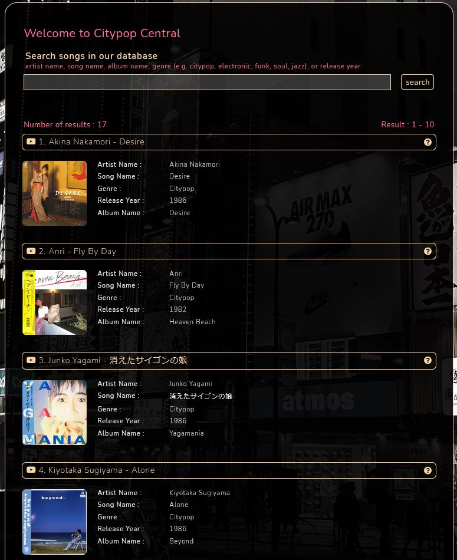
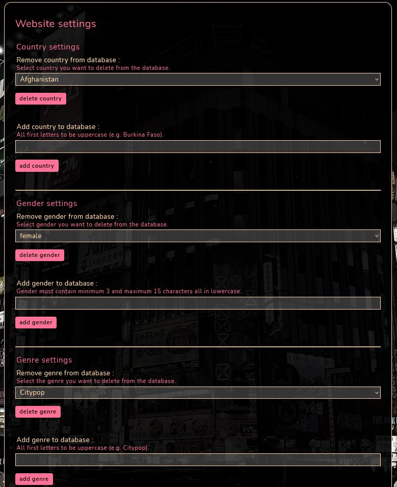

<h1 align="center">Citypop Central - 70's and 80's Japanese Songs</h1>

<!-- Responsive Image -->

<!-- Links -->
View the Live project on Heroku [link](https://citypop-central.herokuapp.com/) 
View the GitHub Respository [link](https://github.com/Eburonia/citypop-central/)

<!-- About -->
## About
The Citypop Central website contains information about Japanese songs and a link to the song's YouTube page. In our database, you find songs that are a mix of Jazz, Soul, Funk, Disco, or Synth-Pop from the '70s and '80s.  Combined with Japanese lyrics is this genre better known under the name 'Citypop.'

Back in the '70s and '80s, Japan had a strong economy that eventually would collapse. This era was better known as the 'Bubble economy.' Everybody had a good income, poverty almost did not exist, and a lot of money was made and spent during those years. Life was good, especially in the nightlife districts of Tokyo and other big Japanese cities. It was during those years that 'Citypop' became very popular in Japan.

The lyrics in a typical 'Citypop' song translated the spirit of the Japanese people at that time. The songs are about a bright future, optimism, and a glamorous lifestyle. All this ended around 1991 when the Tokyo stock exchange, the 'Nikkei' had plummeted to half. The glamorous lifestyle of the '80s was over. Many Japanese people lost their job, many lost money in a housing crisis,  and most did not know what the future would bring. Together with this economic tragedy, the 'Citypop' genre disappeared from the mainstream, making space for new types of music genres.

'Citypop' was never popular in the Western world in the '70s and '80s. But thanks to Youtube, people from the West are discovering this music genre. The purpose of this website is to target those people who want to know more about the 'Citypop' genre and who want to listen to typical 'Citypop' songs.

#### More Information
For more information about Citypop, check the following videos on YouTube:  
- A Brief History of Citypop [link](https://www.youtube.com/watch?v=ouXHiSSYwZY)  
- Western Tourists Buying Old Citypop LPs [link](https://www.youtube.com/watch?v=QZsRsccMDm8)  

<!-- Table of Contents -->
## Table of Contents

[User Experience (UX)](#UX)

[Features](#features)

[Data Scheme](#scheme)

[Technologies Used](#technologies)

[Testing](#testing)

[Known Bugs](#bugs)

[Deployment](#deployment)

[Credits](#credits)

<!-- User Experience (UX) -->

## User Experience (UX)

### User Stories

#### Visitor User Goals

1. As a visitor of the website, I want to understand what the website's purpose is.
2. As a visitor of the website, I want to navigate easily throughout the website, so I don't get frustrated not knowing where to click.
3. As a visitor of the website, I want to target specific songs, so I don't get lost when I have to scroll through all available songs on the website.
4. As a visitor of the website, I not only want to find information about the songs, but I also want to listen to the songs.
5. As a visitor of the website, I want to see the album cover of the song.
6. As a visitor of the website, I might want to contact the website owner, so I can ask a question or give some feedback.

#### Returning Visitor User Goals
1. As a returning visitor of the website, I want to be able to not only search for song information or listen to the songs but also want to add my own (favorite) songs to the database.
2. As a returning visitor of the website, I want to log out from my user account for safety reasons.
3. As a returning visitor of the website, I want to know which songs I have uploaded in the past.
4. As a returning visitor of the website, I want to delete my profile whenever I want.
5. As a returning visitor of the website, I want to be able to update my user account in case some information about me (e.g. location) has been changed.
6. As a returning visitor of the website, I want to be able to see information about other users of the website and contact them when needed.

#### Administrator User Goals
1. As an administrator of the website, I want to be able to adjust all uploaded songs, so I can change them for whatever reason.
2. As an administrator of the website, I want to adjust other information which is relevant to the website.
3. As an administrator of the website, I want to know when songs were updated for the last time.
4. As an administrator of the website, I want to be able to delete unwanted users.

### Design

#### Colour Scheme
The following colours were used throughout the webpage:
- rgba(0, 0, 0, 0.9): black transparent, used as background colour in the header and forms, and buttons.
- rgba(251, 213, 168, 1): yellow, used for logo, login/logout button, division frame borders, textfields, form texts, and socials.
- rgba(255, 113, 151, 1): pink, used for logo, headings, comments forms, hover colour, register button, pagination, and buttons.
- rgba(238, 238, 238, 1): white, used for logo, search record information fields, comments on forms.
- rgba(255, 255, 255, 0.2): gray transparent, used in textfields background colour.
- rgba(255, 0, 0, 1): red, used on critical links e.g. deleting your profile or deleting a song.
- rgba(135, 206, 235, 1): skyblue, used for flash messages in case passwords don't match on the register page. 

 
Colour scheme

#### Typography
The '[Nunito](https://fonts.google.com/specimen/Nunito)' font was implemented from the Google Fonts website and used throughout the whole website including the website logo.
Sans-serif has been set as fallback font.

 
Nunito font-type

#### Imagery
- There are five different hero background images implemented on every page. The background images are all street scenes from Tokyo made by the website owner in the year 2019. The colours are adjusted in such a way it won't distract the information in the foreground.
   - Background image 1 - [link](static/img/background1.jpg)
   - Background image 2 - [link](static/img/background2.jpg)
   - Background image 3 - [link](static/img/background3.jpg)
   - Background image 4 - [link](static/img/background4.jpg)
   - Background image 5 - [link](static/img/background5.jpg)

- All Album Cover images are implemented from the [discogs.com](https://www.discogs.com/) website. This is not a proper way of doing this because we are using somebody else its data, but because we don't have a server where we can upload and read images, it's the only solution for the moment.

#### Wireframes
Wireframes beloning to the website's project have been made in [Adobe XD](https://www.adobe.com/products/xd.html).
The wireframes are implemented in markdown files and can be accessed over here:
- Wireframes of the '404' Page - [link](static/readme-images/wireframes/wireframes-404.md)
- Wireframes of the 'About' Page - [link](static/readme-images/wireframes/wireframes-about.md)
- Wireframes of the 'Add Song' Page - [link](static/readme-images/wireframes/wireframes-addsong.md)
- Wireframes of the 'Edit Song' Page - [link](static/readme-images/wireframes/wireframes-editsong.md)
- Wireframes of the 'Login' Page - [link](static/readme-images/wireframes/wireframes-login.md)
- Wireframes of the 'My Songs' Page - [link](static/readme-images/wireframes/wireframes-mysongs.md)
- Wireframes of the 'Profile' Page - [link](static/readme-images/wireframes/wireframes-profile.md)
- Wireframes of the 'Register' Page - [link](static/readme-images/wireframes/wireframes-register.md)
- Wireframes of the 'Results/Index' Page - [link](static/readme-images/wireframes/wireframes-results.md)
- Wireframes of the 'Settings' Page - [link](static/readme-images/wireframes/wireframes-settings.md)
- Wireframes of the 'Userinfo' Page - [link](static/readme-images/wireframes/wireframes-userinfo.md)
- Wireframes of the 'Users' Page - [link](static/readme-images/wireframes/wireframes-users.md)
- Wireframes of the 'Youtube' Page - [link](static/readme-images/wireframes/wireframes-youtube.md)

All wireframes were designed for three different devices:
- Desktop - Web: maximum viewport width 1920px
- iPad - Nexus 9: maximum viewport width 768px
- iPhone - 12 Pro Max: maximum viewport width 428px

#### Mockups
Due to the limited available time of the web developer, mockups have not been created.
Instead, an image of the responsive design has been added on top of this README file.

<!-- User Experience (UX) -->

## Features

### Header
A header has been added on top of every page and exists out of the website logo, and a navigation bar. The background colour used for the header is a black transparent colour as described in the colour scheme section in this README file. The navigation bar will change to a 'hamburger-style' navigation menu on smaller devices (e.g. iPad or smartphone). Hovering the navigation bar's hyperlinks will make them highlight, making it clear to the end-user these are clickable links. The company logo on the top left-hand side of the header has a clickable hyperlink assigned to it which will redirect the website to the 'Index' page. The Company logo will automatically resize for smaller devices.

### Footer
A footer has been added on the bottom of the 'Index,' 'Results' and 'YouTube' pages and exists out of social media links (Twitter, Pinterest and, Instagram) and a copyright notice. The social media links are styled in yellow colour. By hovering the social media link icons, the colour will highlight in pink colour as described in the colour scheme section of this README file, making it clear to the end-user these are clickable links. The icons used for the social media links are directly loaded from the [fontawesome](https://www.fontawesome.com) website. All social media links will be opened on a new blank page. A clear copyright notice is visible at the bottom of the footer.

### Index Page
The 'Index' page is the starting point of the website and starts with a welcoming statement to every visitor. Below the statement, an implemented search bar makes it possible for users to search through the website's songs database. To help visitors to add correct keywords, above the search bar, example keywords are indicated (artist name, song name, album name, genres, and release year). Below the search bar, a summary of the 8 latest songs added to the database is shown to the visitor. These album covers are clickable and will open a new blank page to the website's 'YouTube' page which has an embedded YouTube video of the song. The bottom of the page ends with the footer has described above.

### 404 Page
The '404' page is a simple-looking page stating the 404 error message and a link to re-direct the visitor/user back to the 'Index' page.

### About Page
The 'About' page gives information to the visitor about the history and background information of the Citypop genre. Also embedded are two YouTube videos about the history of Citypop and a video of Western tourists buying Citypop LP records at a local used record store in the Shibuya district of Tokyo.

### Add Song Page
On the 'Add song' page, only a user can add songs to the Citypop Central database. The user needs to add the necessary song information into a form. On top of every data field, some extra information is given to the user to add the correct data information. Regular expression is introduced to force the user to add correct data to the database. Because it is not possible to store images in the database, all album cover images have to be loaded from the discogs.com website by adding the link to the image. In case no album cover image is available, the album image data field stays empty. The website automatically adds a 'no-cover' image to the song when leaving the album image data field and should pop up on the screen! Add the song from the Youtube website by adding the video link ID. Every YouTube song this ID can be found in the address bar when playing a specific song on the YouTube website, and it looks like this: https://www.youtube.com/watch?v=pE2D3LWADFg --> 'pE2D3LWADFg' is the video link ID!

### Edit Song Page
The 'Edit song' page looks and works the same as the 'Add song' page and functions almost the same. Instead of adding a song to the database, a song can be edited here. At the bottom below the 'Edit song' button, a 'Delete song' section has been introduced. By clicking the hyperlink 'Click here to delete this song' another hyperlink will pop up in a red colour 'Confirm to delete this song'. By clicking the second hyperlink the song will be deleted from the database. Only the user who originally added the song to the database is also able to edit the song, with an exception for the administrator or 'admin' of the website.

### Login Page
On the 'Login' page, existing users login into their Citypop Central account. The correct username or password needs to be added to the form to access the user account. A flash message will pop up when submitted an incorrect username, or password. The flash message will not tell whether the username or password was incorrect. At the bottom below the 'Login' button, a hyperlink has been introduced re-directing visitors to the 'Register' page in case they want to create a user account.

### My Songs/All Songs Page
On the 'My Songs' page, a summary of all uploaded songs by the user is indicated. In case logged in as the administrator 'admin' of the website, this page (All Songs) will summarize ALL songs in the database. Songs are alphabetically sorted by the artist's name and then song name. By clicking on one of the songs, the user will be re-directed to the 'Edit song' page. Here the user or admin can change the song's data information or even delete the song.

### Profile Page
On the 'Profile' page, the user can update user-related information like email address, the country currently living in, and whether you want to share your email address with other users. It is not possible to update your username and gender.  Updating your password has not been introduced for now. At the bottom below the 'Update' song button, a 'Delete profile' section has been introduced. By clicking the hyperlink 'Click here to delete your profile' another hyperlink will pop up in a red colour 'Confirm to delete your profile.' By clicking the second hyperlink your account/profile will be deleted from the website and you are no longer able to log in under the profile's username.

### Register Page
On the 'Register' page, a visitor can create a Citypop Central user account. Indicated are necessary information data fields like username, password, email address, the country you live in, and gender. On top of every data field, some extra information is given to the user to add the correct data information. Regular expression is introduced to force the visitor to add correct data to the database. When submitting the form, the back-end of the website checks whether the submitted username or email address already exists or not. A double-check is done when adding the new password. Visitors have to add the passwords twice. This is to check whether the user did not made a typo when adding the password. A blue message will pop up above the password data field, warning the visitor both passwords are not matching. The summary of all countries and genders is directly imported from the database, making it easy for the administrator of the website to update or edit them in case needed. This can be done on the 'Settings' page when the administrator is logged in. For now, users can communicate with each other by email. The user email address will be shown on the 'Userinfo' page of the user and is only visible for other logged-in users. Maybe the user doesn't want to expose the email addresses to other users. an option is given on the user's 'Profile' page to not share the email address. At the bottom below the 'Register' button, a hyperlink has been introduced re-directing visitors to the 'Login' page in case they want to login to their existing user account.

### Results Page
The 'Results' page will show up at the moment a visitor has added a search query in the search bar on the 'Index' page. The results found in the database will then show up on the screen. In case no results are found, a flash message will pop up telling the visitor 'No results found.' The maximum number of records shown on the screen is limited to 10 records per page. On the top left side of the search results, the number of results found in the database is shown. On the right side, the currently shown records are also indicated (e.g. Result 1 - 10). All displayed records show the following information: Artist Name, Song Name, Genre, Release Year, Album Name. An expanded information button (question mark icon) to show additional information about the song is introduced. By clicking this icon more information will show up on the screen. This information is Song Length, Uploaded By, Upload Date, Edit Date. The 'Edit Date' will only be shown when the song has been edited after it has been added to the database. By clicking the Artist Name or Song Title at the top of every search record, the visitor will be automatically redirected (blank page) to the website's 'YouTube' page of the song. On this page, the YouTube video of the song has been embedded and the video will play automatically when the page is loaded.
On the right side of the Artist Name and Song Name, when logged in, the user can see whether he has uploaded this song before. An 'Edit' and 'Delete' icon will be shown if that is the case. By clicking the 'Garbage Bin' icon the user can directly delete the song from the database and by clicking the 'Pen' icon, the user can directly edit the song. 
An image of the 'Album Cover' of the song's album is indicted. By clicking the album image a larger image will show op on screen.

### Settings Page (for admin only)
Only the administrator 'admin' of the website has access to the 'Settings' page. Here the administrator can add or delete the following information in/from the database: Country names (for users), Genders (for users), Genres (for songs), Release Years (for songs).

### User Info Page
The 'User Information' page gives information about a user to other users or visitors. The email address indicated on the 'User Information' page is only visible to logged-in users. A user can turn off the visibility of their email to other users on the 'User Information' page by disabling it on their 'Profile' page. To access the user information page, click on the expand link (?) of a song to see which user uploaded the song. By clicking on the username the user information page will pop up (blank page).

### Users Page (for admin only)
Only the administrator 'admin' of the website has access to the 'Users' page. Here the administrator sees a summary of all users and can delete unwanted users from the database by clicking the delete icon 'Garbage Bin'. A second red coloured 'Garbage Bin' will pop up and by clicking this icon, the specific user will be deleted from the website and database and will be no longer able to enter his account.

### YouTube Page
By clicking the Artist Name or Song Title at the top of every search record on the 'Results' page, the visitor will be automatically redirected (blank page) to the website's 'YouTube' page of the song. On this page, the YouTube video of the song has been embedded and the video will play automatically when the page is loaded.

### Flash Messages
Flash messages will pop up with useful information for the user and can be closed by clicking the cross icon.

### Forms
Same styling for all forms on every page.

### Responsiveness
All pages are responsive on all devices. Designed for minimum viewport width of: 320px.

### Accessibility
* All images have been foreseen with an alternative (alt) text in case the image cannot be loaded. This also helps the screen readers.
* Aria-labels have been introduced where needed to give important information to the screen readers.

### Future Features
* A message function for users to communicate with each other instead of using e-mail communication.
* Implementation of an image database instead of loading album images from the [discogs.com](https://www.discogs.com/) website.
* Sub-divide the JavaScript code, all code is now loaded on all pages.
* At this moment it is not possible to update your password, to be implemented in the future.
* Data in the database are all saved as strings, can be changed to other data types like int for release years.

<!-- Data Scheme -->

## Data Scheme

The MongoDB Data Scheme Citypop Central

<!-- Technologies Used -->

## Technologies Used

### Languages Used
- [HTML5](https://en.wikipedia.org/wiki/HTML5)
- [CSS3](https://en.wikipedia.org/wiki/CSS)
- [JavaScript](https://en.wikipedia.org/wiki/JavaScript)
- [jQuery](https://en.wikipedia.org/wiki/JQuery)
- [Python](https://en.wikipedia.org/wiki/Python_(programming_language))
- [Jinja](https://en.wikipedia.org/wiki/Jinja_(template_engine))

### Frameworks, Libraries and Programs Used
- [jQuery v3.5.1](https://jquery.com/download/) - jQuery which is a JavaScript Library mainly used for manipulating the HTML DOM tree, is used on some pages.
- [Font Awesome](https://www.fontawesome.com/) - Font Awesome icons are used on the website for linking to the social media pages and edit and delete purposes.
- [Git](https://git-scm.com/) - Git was used for version control and code change tracking of the website project. The terminal in Gitpod was used to commit and to push the project to the Github repository.
- [Github](https://github.com/) - The project code has been stored on the Github website.
- [GitPod](https://www.gitpod.io/) - GitPod was used for creating the code, testing of the website, commiting, and pushing the code to the github repository.
- [Heroku](https://www.heroku.com/) - The project has been imported from the Github website to the Heroku website which allows Python related projects.
- [Adobe XD](https://www.adobe.com/products/xd.html) - Adobe XD was used to create the website's Wireframes. To see the Wireframes, go to the Design section above to see the results.
- [Photopea.com](https://www.photopea.com/) - The Photopea website was used for editing the README file images.
- [Flask](https://en.wikipedia.org/wiki/Flask_(web_framework)) - Flask is a micro web framework written in Python used for interaction between front-end and back-end of the website.

### Database
- [MongoDB](https://www.mongodb.com/) - The website uses the document-oriented database MongoDB.

<!-- Testing -->

## Testing

### Functionality Checklist

#### Common

- Check aria labels. **(checked)**
- Check aria labels start with a capitalized letter. **(checked)**
- Check alternative 'alt' text images. **(checked)**
- Check available title tags. **(checked)**
- Check title tags all start with a capitalized letter. **(checked)**
- Check whether page titles are loaded correctly. **(checked)**
- Check all needed CSS files are imported properly. **(checked)**
- Check commented out code. **(checked)**
- Check comments added to code files. **(checked)**
- Check for non-functioning Python code. **(checked)**
- Turn off Flask debug mode. **(checked)**

#### Background (Hero) Images
- Check whether background image sizing is around 500 kB. **(checked)**
- Check whether all 5 background randomized images will show up. **(checked)**
- Check whether background images show up properly on smaller devices. **(checked)**

 
Background (Hero) Image

#### Header/Navigation Bar
- Check whether the header is always on top of the pages. **(checked)**
- Check whether the website logo links back to the index page. **(checked)**
- Check for dead links. **(checked)**
- Check the responsiveness of the navigation bar (change to hamburger-style navigation for minimum 320px width). **(checked)**
- Check whether there is overflow while reducing the screen size. **(checked)**
- Check navigation hover-links. **(checked)**
- Check the 'About' link always shows up when logged out. **(checked)**
- Check the 'Profile,' 'My Songs,' 'Add Song' links show up when logged in. **(checked)**
- Check the 'Logout' button shows up when logged in. **(checked)**
- Check whether the toggle button functions properly. **(checked)**

 
Header on Phone

#### Footer
- Check whether the footer is on the bottom of the 'Index,' 'Results,' 'Youtube' and 'About' page. **(checked)**
- Check whether all social media links are working properly and are opening a new blank page. **(checked)**
- Check whether the social media links change colour when hovering. **(checked)**
- Check for dead links. **(checked)**
- Check the responsiveness on smaller devices (min. 320px width). **(checked)**

 
Footer

#### Index Page
- Check the responsiveness of the page. **(checked)**
- Check the latest uploaded song links function and open in a new screen. **(checked)**
- Check whether records show up when searching the following keywords: Artist Name, Song Name, Genre, Release Year, Album Name, Uploaded By, Upload Date. **(checked)**
- Check whether a song added to the database shows up to the latest songs summary. **(checked)**

 
Index Page

#### 404 Page
- Check the responsiveness of the page. **(checked)**
- Check 404-page loads when a non-existing page is loaded. **(checked)**
- Check of link redirects to homepage. **(checked)**

 
404 Page

#### About Page
- Check the spelling of the page. **(checked)**
- Check the responsiveness of the page. **(checked)**
- Check the sizing of the embedded Youtube videos. **(checked)**
- Check the functionality of the videos. **(checked)**
- Check the video description. **(checked)**

 
About Page

#### Add Song Page
- Check the responsiveness of the page. **(checked)**
- Check whether the input fields match with the Edit Songs Page. **(checked)**
- Check field description is understandable for a visitor. **(checked)**
- Check whether album image loads correctly. **(checked)**
- Check the regular expression. **(checked)**
- Check whether the added song is in the database. **(checked)**

 
Add Song Page

#### Edit Song Page
- Check the responsiveness of the page. **(checked)**
- Check whether the input fields match with the Add Songs Page. **(checked)**
- Check field description is understandable for a visitor. **(checked)**
- Check whether album image loads correctly. **(checked)**
- Check the regular expression. **(checked)**
- Check whether admin can edit all songs. **(checked)**
- Check whether admin can delete all songs. **(checked)**
- Check whether other users cannot edit songs via address bar. **(checked)**
- Check whether visitors cannot edit songs via address bar. **(checked)**

 
Edit Song Page

#### Login Page
- Check the responsiveness of the page. **(checked)**
- Check the link to the Register page functions. **(checked)**
- Check whether login functions. **(checked)**
- Check regular expression. **(checked)**

 
Login Page

#### My Songs Page (All Songs when logged in as admin)
- Check the responsiveness of the page. **(checked)**
- Check whether Artist Name and Songs Name are properly indicated. **(checked)**
- Check colour changes when hovering. **(checked)**
- Check alphabetical order. **(checked)**
- Check whether all your songs show up. **(checked)**
- Check whether all songs show up when logged in as admin. **(checked)**
- Check whether the correct song information is loaded from the database. **(checked)**

 
My Songs Page

#### Profile Page
- Check the responsiveness of the page. **(checked)**
- Check all country names are capitalized and alphabetically sorted. **(checked)**
- Check the regular expression functions properly for the email text field. **(checked)**
- Check correct username shows up. **(checked)**
- Check whether the 'Delete your profile' link function works properly. **(checked)**
- Check whether all fields are updated in the database when changed. **(checked)**
- Check regular expression. **(checked)**
- Check whether other users have no access to profile page by using the address bar. **(checked)** 
- Check whether visitors have no access to profile page by using the address bar. **(checked)**
- Check whether other users cannot delete a user profile page by using the address bar. **(checked)** 
- Check whether visitors cannot delete a user profile page by using the address bar. **(checked)**

 
Profile Page

#### Register Page
- Check the responsiveness of the page. **(checked)**
- Check the link to the Login page functions. **(checked)**
- Check the regular expressions. **(checked)**
- Check password match functionality. **(checked)**
- Block when username already exists. **(checked)**
- Block when email address already exists. **(checked)**

 
Register Page

#### Results Page
- Check the responsiveness of the page. **(checked)**
- Check whether the 'Expand for more information' icon (question mark) functions properly. **(checked)**
- Check whether the 'Uploaded By' link opens a new blank page. **(checked)**
- Check whether all song information is correct. **(checked)**
- Check whether there is no text-overflow. **(checked)**
- Check whether the Youtube link functions and opens a new blank page. **(checked)**
- Check whether the 'Edit' and 'Delete' icons show up when logged in and check whether they function properly. **(checked)**
- Check the number of results (records) indicated to match the real shown results on the screen. **(checked)**
- Check pagination functions properly. **(checked)**
- Check whether a maximum of 10 records shows up on the screen. **(checked)**
- Check whether 'Edit Date' shows up when the song has been edited. **(checked)**
- Check manipulation of the search bar search keys won't give wrong results or errors. **(checked)**

 
Search results page

 
Edit and Delete Icons

#### Settings Page (for admin only)
- Check the responsiveness of the page. **(checked)**
- Check whether only admin has access to this page. **(checked)**
- Check whether it is possible to delete a country from the database. **(checked)**
- Check whether it is possible to add a country from the database. **(checked)**
- Check whether it is possible to delete a gender from the database. **(checked)**
- Check whether it is possible to add a gender from the database. **(checked)**
- Check whether it is possible to delete a genre from the database. **(checked)**
- Check whether it is possible to add a genre from the database. **(checked)**
- Check regular expression. **(checked)**
- Check unwanted user input from the address bar. **(checked)**

 
Settings Page (for admin only)

#### Userinfo Page
- Check the responsiveness of the page. **(checked)**
- Check all showed information is correct. **(checked)**
- Check e-mail address is hidden for non-users (visitors). **(checked)**
- Check e-mail address is hidden when the user turned it off on the Profile page. **(checked)**
- Check non-existing user return message user does not exist. **(checked)**

 
Userinfo Page

#### Users Page (for admin only)
- Check the responsiveness of the page. **(checked)**
- Check whether only admin has access to this page. **(checked)**
- Check whether all users show up from database. **(checked)**
- Check whether it is possible to delete a user. **(checked)**

 
Users Page (for admin only)

#### Youtube Page
- Check the responsiveness of the page. **(checked)**
- Check song autoplay. **(checked)**

 
Youtube Page

#### Flash Messages
- Check the responsiveness of the flash messages. **(checked)**
- Check flash messages all start with a capitalized letter. **(checked)**
- Check close message is functioning. **(checked)**
- Check whether flash messages appear after a user action. **(checked)**

 
Flash Messages

### Usability Testing
- Family and friends were asked to test the website and to navigate through all website pages. Buttons, links, and contact form were tested by them.

### Compatibility Testing
The following browsers were used for compatibility testing:
- Firefox
- Google Chrome
- Microsoft Edge

### Further Testing
The following devices were used for testing the website:
- Desktop: Asus ZenBook (viewport: 1920px * 1080px) 
- Smartphone: Samsung S9+ (viewport: 360px * 740px)
- Smartphone: iPhone 11 (viewport: 414px * 896px)

During the building of the website, [Google Chrome DevTools](https://developer.chrome.com/) was used to simulate different viewport sizes.
The website is designed for a minimum viewport width of 320px (iPhone 5 size).

### Testing Code
The following online validators were used to check whether the website generated any HTML, CSS, JavaScript/JQuery and Python syntax errors:
   - [W3C Markup Validator](https://validator.w3.org/)
   - [W3C CSS Validator](https://jigsaw.w3.org/css-validator/)
   - [JSHint Validator](https://www.jshint.com/)
   - [PEP8 Online Check](http://www.pep8online.com/)

#### W3C Markup Validator

All HTML code was checked by direct input into the validator (copy & paste).   
The following pages were checked:  

* index.html
* 404.html
* about.html
* add_song.html
* base.html
* edit_song.html
* login.html
* my_songs.html
* profile.html
* register.html
* results.html
* settings.html
* userinfo.html
* users.html
* youtube.html

Errors:  
All pages generate Jinja related errors (the validator does not recognize Jinja code).  
No serious errors discovered.

#### W3C CSS Validator

The following CSS files were checked:
* [about.css](https://jigsaw.w3.org/css-validator/validator?uri=https%3A%2F%2Fcitypop-central.herokuapp.com%2Fstatic%2Fcss%2Fabout.css&profile=css3svg&usermedium=all&warning=1&vextwarning=&lang=en)
* [error404.css](https://jigsaw.w3.org/css-validator/validator?uri=https%3A%2F%2Fcitypop-central.herokuapp.com%2Fstatic%2Fcss%2Ferror404.css&profile=css3svg&usermedium=all&warning=1&vextwarning=&lang=en)
* [footer.css](https://jigsaw.w3.org/css-validator/validator?uri=https%3A%2F%2Fcitypop-central.herokuapp.com%2Fstatic%2Fcss%2Ffooter.css&profile=css3svg&usermedium=all&warning=1&vextwarning=&lang=en)
* [forms.css](https://jigsaw.w3.org/css-validator/validator?uri=https%3A%2F%2Fcitypop-central.herokuapp.com%2Fstatic%2Fcss%2Fforms.css&profile=css3svg&usermedium=all&warning=1&vextwarning=&lang=en)
* [header.css](https://jigsaw.w3.org/css-validator/validator?uri=https%3A%2F%2Fcitypop-central.herokuapp.com%2Fstatic%2Fcss%2Fheader.css&profile=css3svg&usermedium=all&warning=1&vextwarning=&lang=en)
* [my-songs.css](https://jigsaw.w3.org/css-validator/validator?uri=https%3A%2F%2Fcitypop-central.herokuapp.com%2Fstatic%2Fcss%2Fmy-songs.css&profile=css3svg&usermedium=all&warning=1&vextwarning=&lang=enn)
* [profile.css](https://jigsaw.w3.org/css-validator/validator?uri=https%3A%2F%2Fcitypop-central.herokuapp.com%2Fstatic%2Fcss%2Fprofile.css&profile=css3svg&usermedium=all&warning=1&vextwarning=&lang=en)
* [random-songs.css](https://jigsaw.w3.org/css-validator/validator?uri=https%3A%2F%2Fcitypop-central.herokuapp.com%2Fstatic%2Fcss%2Frandom-songs.css&profile=css3svg&usermedium=all&warning=1&vextwarning=&lang=en)
* [results.css](https://jigsaw.w3.org/css-validator/validator?uri=https%3A%2F%2Fcitypop-central.herokuapp.com%2Fstatic%2Fcss%2Fresults.css&profile=css3svg&usermedium=all&warning=1&vextwarning=&lang=en)
* [settings.css](https://jigsaw.w3.org/css-validator/validator?uri=https%3A%2F%2Fcitypop-central.herokuapp.com%2Fstatic%2Fcss%2Fsettings.css&profile=css3svg&usermedium=all&warning=1&vextwarning=&lang=en)
* [users.css](https://jigsaw.w3.org/css-validator/validator?uri=https%3A%2F%2Fcitypop-central.herokuapp.com%2Fstatic%2Fcss%2Fusers.css&profile=css3svg&usermedium=all&warning=1&vextwarning=&lang=en)
* [userinfo.css](https://jigsaw.w3.org/css-validator/validator?uri=https%3A%2F%2Fcitypop-central.herokuapp.com%2Fstatic%2Fcss%2Fuserinfo.css&profile=css3svg&usermedium=all&warning=1&vextwarning=&lang=en)
* [youtube.css](https://jigsaw.w3.org/css-validator/validator?uri=https%3A%2F%2Fcitypop-central.herokuapp.com%2Fstatic%2Fcss%2Fyoutube.css&profile=css3svg&usermedium=all&warning=1&vextwarning=&lang=en)

Warnings:  
Validator does not recognize CSS variables.  
No errors discovered.

#### JSHint Validator

The following JavaScript/JQuery file was checked by direct input into the validator (copy & paste):
* script.js

Errors:   
No errors discovered.

#### PEP8 Online Check

The following Python file was checked by direct input into the validator (copy & paste):
* app.py

Errors:   
No errors discovered.

### Testing Grammar and Spelling 
- [Grammarly.com](https://www.grammarly.com/) was used to check grammar and spelling.

### Testing User Stories from User Experience (UX) Section

#### Visitor User Goals

1. As a visitor of the website, I want to understand what the website's purpose is.
   * In the upper left corner of the website's header, the website logo tells the visitor the website name: 'Citypop Central 70's and 80's Japanese Music'.
   * For Japanese visitors or people who can read Japanese, also Citypop Central was written in Japanese Hiragana: 'シティ・ポップ・セントラル.'
   * The 'Search songs in our database' search field and button on the 'Index' page tells it is possible to search for songs on the website.
   * Certain keywords are added above the search songs field to help the visitor use the correct keywords.
   * A link to the 'About the citypop central website' page has been added. Here the visitor finds information about the website and Citypop genre.
   * On the 'Register' page, it tells visitors you can add your songs into the database when you register.

 
Search Bar

2. As a visitor of the website, I want to navigate easily throughout the website, so I don't get frustrated not knowing where to click.
   * A navigation bar in the header is available on every page in the upper right corner.
   * The website is easily usable for visitors who are only searching for songs. All links and buttons are foreseen with a title explaining the purpose which can be excessed when hovering.
   * Search results are limited to a maximum of 10 songs per page. Pagination has been introduced to switch to the next or previous pages.
   * Every search result has a (?) button that expands less relevant information about each song.

 
Expand More Button (?) Upper Right Corner

3. As a visitor of the website, I want to target specific songs, so I don't get lost when I have to scroll through all available songs on the website.
   * Visitors can search under the following keywords: Artist name, Song name, Genre, Release Year, Album Name, Uploaded By, and Upload Date.

4. As a visitor of the website, I not only want to find information about the songs, but I also want to listen to the songs.
   * At the top of every search record, the Artist's name and Song name are indicated. A YouTube icon in front of the Artist's name has been implemented telling the visitor this is a clickable link. By hovering the link the text 'Watch on YouTube' will pop up. By clicking this link, the visitor will be redirected to a blank page that includes the embedded Youtube video of the song. For convenience reasons, all records will play automatically.

 
Link to YouTube Songs Page

5. As a visitor of the website, I want to see the album cover of the song.
   * For every search record, you can press the album image and a larger size image will appear on the screen.

6. As a visitor of the website, I might want to contact the website owner, so I can ask a question or give some feedback.
   * On the bottom, inside the search function division of the 'Index,' 'About' and 'Youtube' pages, hyperlinks to the website's social media accounts are indicated. By clicking on one of the links, the visitor will be redirected to these social media accounts. Here the visitor can send direct messages to the website owner.

#### Returning Visitor User Goals
1. As a returning visitor of the website, I want to be able to not only search for song information or listen to the songs but also want to add my own (favorite) songs to the database.
   * By clicking the 'Register' button, every visitor can create a user account. When done, the visitor will get access to an 'Add Song' form. Here the user can add all information needed to upload a song: Artist Name, Song Name, Genre, Release Year, Album Name, Album Image, Song Length, and the YouTube video ID.
   * Next to adding songs to the website, the user will also be able to 'Edit' and 'Delete' the added songs.
   * The username will appear below the navigation bar when the user is logged-in. 
   * A summary of all uploaded songs is available on the 'My Songs' page. By clicking on one of the song's hyperlinks, the user will be automatically redirected to the page where the song can be edited.
   * When a user account is created, visitors become users and will also have access to a 'Profile' page. Here some additional information about the user is added and can be updated.
   * When registered, visitors become users and are now able to maintain their profile information, add songs, edit songs, delete songs. This means only songs you have added to the database, not songs uploaded by other users.
   * Regular expressions have been added where needed, to help the user understand what input is expected, additional information has been added above every data field.

 
Navigation Bar Logged in Users

2. As a returning visitor of the website, I want to log out from my user account for safety reasons.
   * When logged in into your user account, it clearly states a logout button in the header's upper right corner.

3. As a returning visitor of the website, I want to know which songs I have uploaded in the past.
   * When logged in, in the upper right side of the navigation bar, a link to 'My Songs' will be available. By clicking this link the user will be redirected to a page that gives a summary of all your added songs in the past.

4. As a returning visitor of the website, I want to delete my profile whenever I want.
   * When logged in, at the bottom of your 'Profile' page, a link has been added which gives you the option to delete your user account. A second link has to be clicked to confirm whether you want to delete your profile or not. Your profile will be deleted, but the songs you have added to the website before will stay visible on the website under your name.

5. As a returning visitor of the website, I want to be able to update my user account in case some information about me (e.g. location) has been changed.
   * When logged in, on the 'Profile' page you can update your e-mail and the country you are currently living in.
   * The option to change your password has not been added but will be implemented in the future.

6. As a returning visitor of the website, I want to be able to see information about other users of the website and contact them when needed.
   * Every song record has an information field in the expanded information section of the record stating who uploaded the song  'Uploaded by'. Only users can see and click on the 'Uploaded by' link to see more information about the other user. Here the e-mail address of the user who uploaded the song is indicated. The user has the option to hide this e-mail address for other users on the 'Profile' page.

#### Administrator User Goals
1. As an administrator of the website, I want to be able to adjust all uploaded songs, so I can change them for whatever reason.
   * The administrator has access to the 'All songs' page, here all songs on the website will be alphabetically summarized. The administrator can edit and delete all songs on the website.
2. As an administrator of the website, I want to adjust other information which is relevant to the website.
   * The administrator has access to the 'Settings' page, here it is possible to adjust the following information: Country settings, add or delete country names from the website. Country names are indicated on the user's profile page, telling in which country the user is currently living.
   * The administrator can add or delete other genders to the website. For now only male and female are available. A gender has to be selected by a new user when creating a user account.
   * The administrator can add or delete other genres to the website. For now, 10 different genres are available on the website. A genre is selected by a user when adding a song to the website.
   * The administrator can add or delete other release years to the website. For now, only the years 1970 to 1990 can be selected on the website. A release year is selected by a user when adding a song to the website.
3. As an administrator of the website, I want to know when songs were updated for the last time.
   * Songs will get an extra data field when the song was updated for the last time. Click the expand more information (?) to see this field below the 'Upload Date' field.
4. As an administrator of the website, I want to be able to delete unwanted users.
   * The administrator has access to the 'Users' page, here all users are alphabetically summarized. Here the administrator can delete every user who has access to the website.

 
Navigation Bar Administrator

 
Delete Unwanted Users

<!-- Known Bugs -->

## Known Bugs
* No significant bugs found on the website by the website creator.
* When the Artist Name and Song title become too long, wrapping is needed, this is not an elegant solution and needs to be fixed in the future.
* Some HTML tags don't accept aria labels.
* Regular expression check for YouTube video ID and image hyperlink for thr album cover image is almost impossible to check, other solutions are to be found in the future.
* There is a possibility that it is still possible to manipulate some pages via the address bar, most pages are checked but maybe I have missed one?
* The Python code in the app .py file exceed more than 1000 lines, this gives a warning in the GitHub terminal.
* The Python code in the app .py file has single and double quote marks used in the code, this is not consistent to be updated in the future.
* Users can delete their profile directly via the address bar without defensive programming '/delete-profile', this should be only possible if a user knows about this is possible, although it's better to fix this in the future.
* The GitHub repository has some files and folders I was not sure if I could delete them for the project (.gitpod.dockerfile, .gitpod.yml and .vscode). They are coming from the Code Institute's template.

<!-- Deployment -->

## Deployment

### Publishing
'Heroku' was used for publishing the website. The procedure was as follows:
1. Login to the [Heroku](https://www.heroku.com/) website.
2. Click the 'Create New App' button.
3. Give your app a new unique name, choose your region and then click the 'Create App' button.
4. The app dashboard will appear now.
5. Click the 'GitHub' button in the 'Deployment Method' section.
6. Add your repository name in the 'Search for a Repository to Connect to' text field, then click the 'Search' button. When your repository appears, click the 'Connect' button.
7. Click on the 'Settings' tab, then click on the 'Reveal Config Vars' button.
8. Add the following KEY-VALUES:
- IP -> 0.0.0.0
- PORT -> 5000
- SECRET_KEY -> Copy from env .py file
- MONGO_URI -> Copy from env .py file
- MONGO_DBNAME -> Add from your mongoDB database
9. Make sure there is a 'Procfile' and a 'requirements.txt' file pushed into your GitHub repository.
10. Click on the 'Deploy' tab.
11. Click on the 'Enable Automatic Deploys' button.
12. Click on the 'Deploy Branch' button.
13. Wait until the website got deployed.
14. Click the 'View' button to see your deployed website on Heroku.

 
Publishing of website on heroku

### Forking
If you want to make a copy of the repository you can Fork it without changing the original repository by following the next procedure:
1. Login to the [GitHub](https://www.github.com/) website.
2. On the left side of your screen, you can find a summary of all repositories. Select [Eburonia/citypop-central](https://github.com/Eburonia/citypop-central)
3. On the right side of your screen, next to 'Unwatch' pull-down menu, and the 'Star' button, you can find the 'Fork' button.
4. By clicking this button, it will create a copy of the website in your repository.

 
Forking of website on github

### Cloning
You can clone the repository by following the next procedure:
1. Login to the [GitHub](https://www.github.com/) website.
2. On the left side of your screen, you can find a summary of all repositories. Select [Eburonia/citypop-central](https://github.com/Eburonia/citypop-central)
3. Click on the 'Code' button next to the Green 'GitPod' button.
4. Click on 'HTTPS' and copy the hyperlink below it.
5. Go to the repository where you want to make a clone of the website. Or create a new repository.
6. When in this repository, select the folder or create a folder where you want to clone the directory.
7. Go to the terminal and type: 'Git Clone (copied link)' and press enter. The directory has been cloned now.

 
Cloning of website on github

### Downloading
You can download the repository by following the next procedure:
1. Login to the [GitHub](https://www.github.com/) website.
2. On the left side of your screen, you can find a summary of all repositories. Select [Eburonia/citypop-central](https://github.com/Eburonia/citypop-central)
3. Click on the 'Code' button next to the Green 'GitPod' button and then click on 'Download ZIP'.
4. A .zip file of the repository content will be downloaded. 

 
Downloading of website on github

<!-- Credits -->

## Credits

### Code
- All HTML, CSS, jQuery, JavaScript, Python, and Jinja code was written by the website creator: Maurice Vossen.
- Regular Expression. [link](https://www.html5pattern.com/Passwords)
- Query Pagination in Flask and MongoDB - API Example. [link](https://www.youtube.com/watch?v=Lnt6JqtzM7I)
- Understanding how aspect-ratio works in CSS for the iframe Youtube Video Screen. [link](https://www.youtube.com/watch?v=FF3fuYLnApQ)

### Content

#### README file
For consistency reasons, the README file of the website creator's previous project [Japanese Restaurant Shibuya](https://github.com/Eburonia/japanese-restaurant-shibuya) was used as a basis for the README file of this project.

#### About Page
All content on the 'About' page was written by the website creator.

### Media

#### Images
- The website logo was created by the website creator.
- All album images are directly loaded from the [discogs.com](https://www.discogs.com/) website.
- All images in this README file were created by the website creator.

 
Logo of the website

### Acknowledgements
- Thanks to my personal mentor Victor Miclovich for answering my questions and giving feedback to this project.
- The many free coding forums on the internet, especially [Stackoverflow.com](https://www.stackoverflow.com/) for providing answers to my coding questions. Most of my questions were already asked by other users of the stackoverflow website, making it easy to find quick answers.

